# Fedora 44 Post-Install: Complete Visual Flowchart & Logic Specification

This document provides a **complete visual flowchart and logic breakdown** of the Fedora 44 Post-Install Setup Script (`setup.sh`).

It is designed for humans to visually trace every decision diamond, hardware detection path, package transaction, user prompt, and configuration state transition from launch to completion.

---

## Table of Contents

1. [Master Lifecycle Flowchart](#1-master-lifecycle-flowchart)
2. [Profile Selection & Routing Decision Tree](#2-profile-selection--routing-decision-tree)
3. [Subsystem Flowcharts (Step-by-Step)](#3-subsystem-flowcharts-step-by-step)
   - [Step 1: DNF & Repository Setup (`setup_dnf`)](#step-1-dnf--repository-setup-setup_dnf)
   - [Step 2: DNS Configuration (`setup_dns`)](#step-2-dns-configuration-setup_dns)
   - [Step 3: Power Optimization & TLP (`setup_power`)](#step-3-power-optimization--tlp-setup_power)
   - [Step 4: No-Sleep & Greeter Policies (`setup_nosleep`)](#step-4-no-sleep--greeter-policies-setup_nosleep)
   - [Step 5: System Fonts & Nerd Fonts (`setup_fonts`)](#step-5-system-fonts--nerd-fonts-setup_fonts)
   - [Step 6: ZSH Shell, Starship & Terminal (`setup_shell`)](#step-6-zsh-shell-starship--terminal-setup_shell)
   - [Step 7: Browser, Codecs & Bluetooth HD Audio (`setup_browser_multimedia`)](#step-7-browser-codecs--bluetooth-hd-audio-setup_browser_multimedia)
   - [Step 8: COPR Packaging Isolation (`setup_copr`)](#step-8-copr-packaging-isolation-setup_copr)
   - [Step 9: GNOME Desktop Polish & GSConnect (`setup_gnome`)](#step-9-gnome-desktop-polish--gsconnect-setup_gnome)
   - [Step 10: Essential Packages & Gaming (`setup_packages`)](#step-10-essential-packages--gaming-setup_packages)
   - [Step 11: Developer Ecosystem & PostgreSQL 18 (`setup_dev`)](#step-11-developer-ecosystem--postgresql-18-setup_dev)
   - [Step 12: Code Editor Suite & Polyglot Runner (`setup_editor`)](#step-12-code-editor-suite--polyglot-runner-setup_editor)
   - [Step 13: Flatpak Applications (`setup_flatpaks`)](#step-13-flatpak-applications-setup_flatpaks)
   - [Step 14: Docker Container Engine (`setup_docker`)](#step-14-docker-container-engine-setup_docker)
   - [Step 15: KVM/QEMU Hardware Virtualization (`setup_kvm`)](#step-15-kvmqemu-hardware-virtualization-setup_kvm)
   - [Step 16: Pre-Driver Kernel Gate (`setup_pre_driver_reboot`)](#step-16-pre-driver-kernel-gate-setup_pre_driver_reboot)
   - [Step 17: GPU Driver Detection & Secure Boot MOK (`setup_drivers`)](#step-17-gpu-driver-detection--secure-boot-mok-setup_drivers)
   - [Step 18: Summary & Service Health Check (`show_summary`)](#step-18-summary--service-health-check-show_summary)
4. [Idempotency, State & Rollback Flowchart](#4-idempotency-state--rollback-flowchart)

---

## 1. Master Lifecycle Flowchart

The high-level execution pipeline from CLI invocation to system readiness:

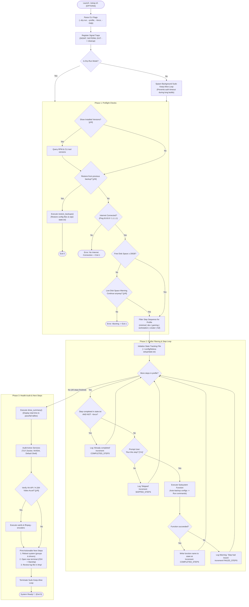

---

## 2. Profile Selection & Routing Decision Tree

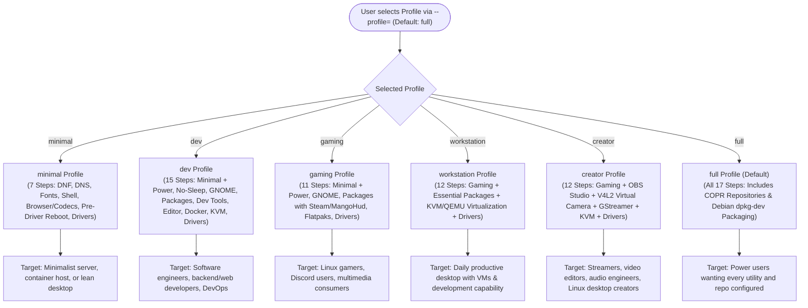

---

## 3. Subsystem Flowcharts (Step-by-Step)

### Step 1: DNF & Repository Setup (`setup_dnf`)

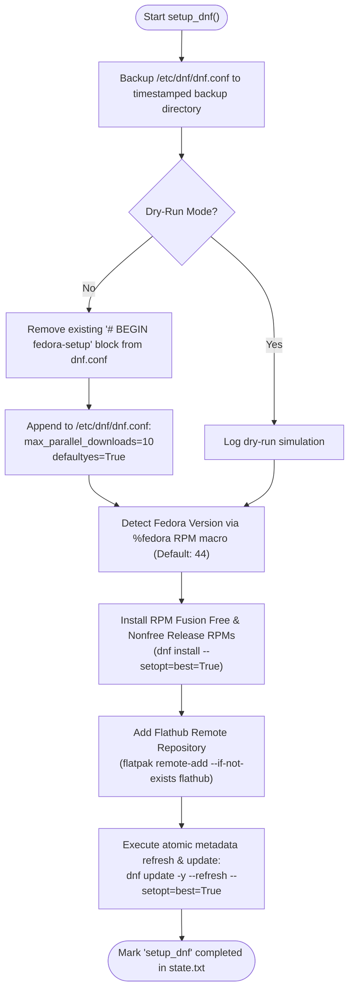

---

### Step 2: DNS Configuration (`setup_dns`)

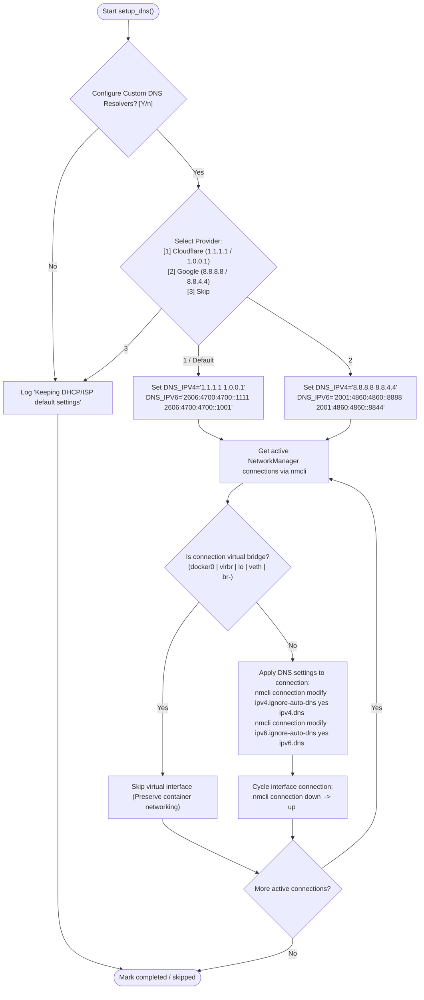

---

### Step 3: Power Optimization & TLP (`setup_power`)

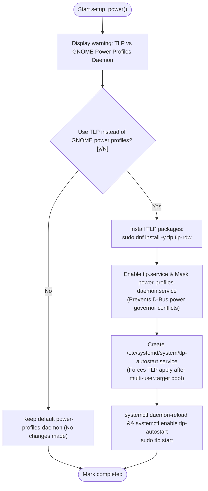

---

### Step 4: No-Sleep & Greeter Policies (`setup_nosleep`)

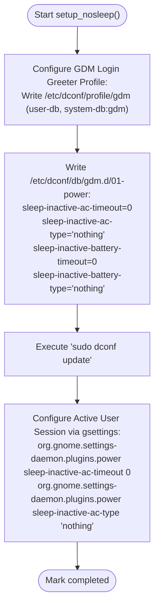

---

### Step 5: System Fonts & Nerd Fonts (`setup_fonts`)

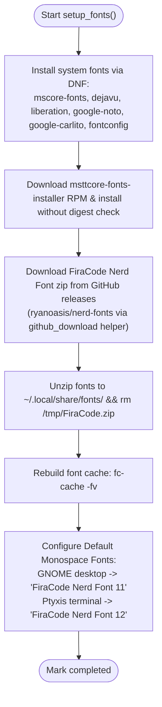

---

### Step 6: ZSH Shell, Starship & Terminal (`setup_shell`)

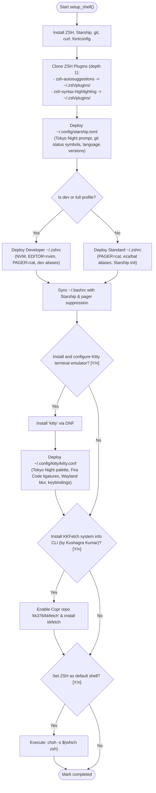

---

### Step 7: Browser, Codecs & Bluetooth HD Audio (`setup_browser_multimedia`)

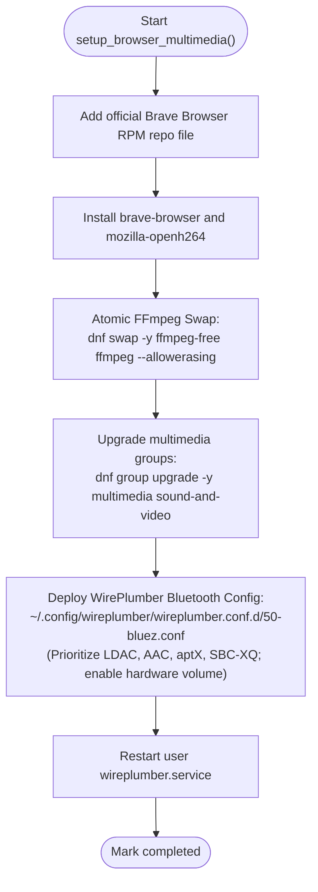

---

### Step 8: COPR Packaging Isolation (`setup_copr`)

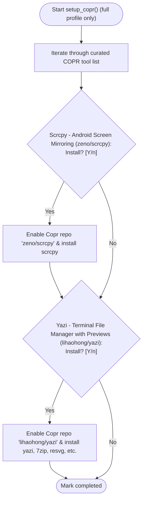

---

### Step 9: GNOME Desktop Polish & GSConnect (`setup_gnome`)

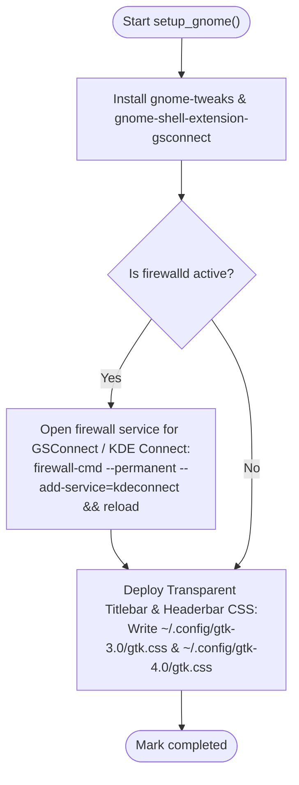

---

### Step 10: Essential Packages & Gaming (`setup_packages`)

```mermaid
flowchart TD
    StartPkgs(["Start setup_packages()"]) --> BuildPkgList["Build core essential package list<br/>(Compilers, Fastfetch, archivers, VLC, Neovim, android-tools, etc.)"]
    
    BuildPkgList --> CheckGamingProfile{"Is gaming profile?"}
    CheckGamingProfile -- Yes --> AddGamingPkgs["Add steam, mangohud to install list"] --> CheckCreatorProfile
    CheckGamingProfile -- No --> CheckCreatorProfile
    
    CheckCreatorProfile{"Is creator profile?"}
    CheckCreatorProfile -- Yes --> AddCreatorPkgs["Add obs-studio, v4l-utils, gtk4-devel, libadwaita-devel, gstreamer1-devel"] --> InstallAllPkgs
    CheckCreatorProfile -- No --> InstallAllPkgs
    
    InstallAllPkgs["Install all packages via DNF (--skip-unavailable)"] --> UnlockSteamH264{"Gaming profile active?"}
    
    UnlockSteamH264 -- Yes --> UnlockH264["Execute Steam H.264 codec unlock (steam://unlockh264/)"]
    UnlockH264 --> DeployMangoHudConf["Deploy ~/.config/MangoHud/MangoHud.conf<br/>(GPU/CPU temps, FPS, frame timing, clean 3-column table)"] --> PromptVesktop
    UnlockSteamH264 -- No --> PromptVesktop
    
    PromptVesktop{"Vesktop (Discord Client with Wayland Screen Audio):<br/>Install? [Y/n]"}
    PromptVesktop -- Yes --> InstallVesktop["Download Vesktop RPM from GitHub Releases & install via DNF"] --> PromptStirling
    PromptVesktop -- No --> PromptStirling
    
    PromptStirling{"Stirling-PDF (Offline Desktop PDF Suite):<br/>Install? [Y/n]"}
    PromptStirling -- Yes --> InstallStirling["Download Stirling-PDF RPM & install via DNF"] --> CheckNVBroadcast
    PromptStirling -- No --> CheckNVBroadcast
    
    CheckNVBroadcast{"Creator profile AND NVIDIA GPU present?"}
    CheckNVBroadcast -- Yes --> PromptNVBroadcast{"NVIDIA Broadcast for Linux (AI Noise & Video FX):<br/>Install? [Y/n]"}
    PromptNVBroadcast -- Yes --> InstallNVB["Git clone (depth 1) & run install.sh --runtime cuda"] --> EndPkgs(["Mark completed"])
    PromptNVBroadcast -- No --> EndPkgs
    CheckNVBroadcast -- No --> EndPkgs
```

---

### Step 11: Developer Ecosystem & PostgreSQL 18 (`setup_dev`)

```mermaid
flowchart TD
    StartDev(["Start setup_dev()"]) --> InstallDevTools["Install low-level developer tools:<br/>meson, ninja, automake, gdb, valgrind, strace, git-lfs, python3-devel, openssl-devel"]
    InstallDevTools --> CheckFullProfile{"Is profile 'full'?"}
    
    CheckFullProfile -- Yes --> InstallDpkgDev["Install dpkg-dev (Debian packaging)"] --> RustPrompt
    CheckFullProfile -- No --> RustPrompt
    
    RustPrompt{"Install full Rust toolchain (rustup, clippy, rust-analyzer)? [Y/n]"}
    RustPrompt -- Yes --> InstallRust["Install rust, cargo, rustup, clippy, rust-analyzer"] --> ConfigCcache
    RustPrompt -- No --> ConfigCcache
    
    ConfigCcache["Configure ccache:<br/>Max size: 50GB, compression: true, cache_dir: ~/.ccache"]
    ConfigCcache --> EnableCorepack["Enable Node.js Corepack (yarn/pnpm)"]
    EnableCorepack --> PythonSymlinks["Create Python symlinks in ~/.local/bin/python"]
    PythonSymlinks --> GitDefaults["Configure Git global defaults:<br/>core.pager=cat, push.autoSetupRemote=true, pull.rebase=true"]
    GitDefaults --> InstallPG18["Install PostgreSQL 18 Server from official PGDG repository"]
    InstallPG18 --> InitPG18{"Is /var/lib/pgsql/18/data initialized?"}
    
    InitPG18 -- No --> RunInitDB["Run: /usr/pgsql-18/bin/postgresql-18-setup initdb"] --> EnablePGService
    InitPG18 -- Yes --> EnablePGService
    
    EnablePGService["systemctl enable --now postgresql-18<br/>Export PATH in /etc/profile.d/pgsql18.sh"]
    EnablePGService --> InstallPGAdmin["Install pgAdmin 4 Desktop GUI from official repo"]
    InstallPGAdmin --> EndDev(["Mark completed"])
```

---

### Step 12: Code Editor Suite & Polyglot Runner (`setup_editor`)

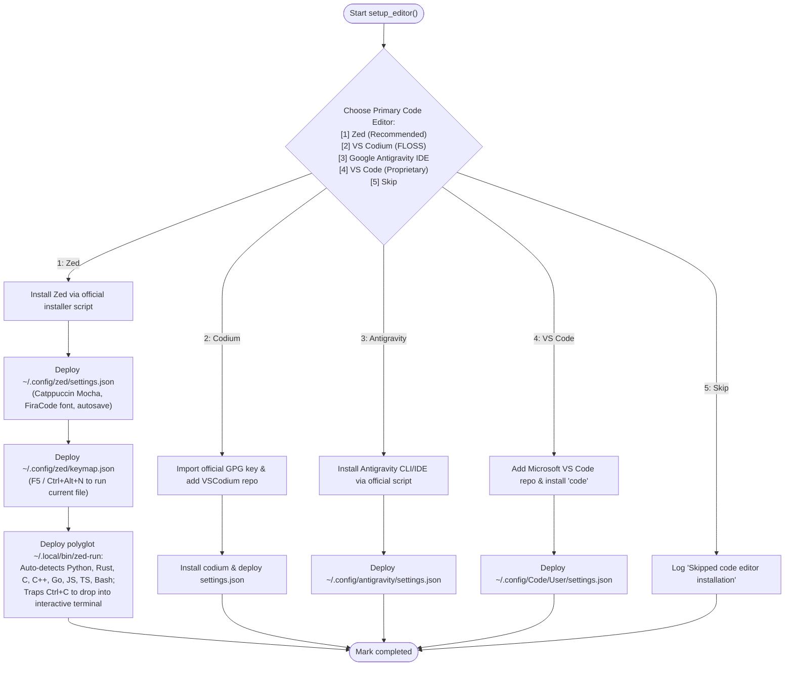

---

### Step 13: Flatpak Applications (`setup_flatpaks`)

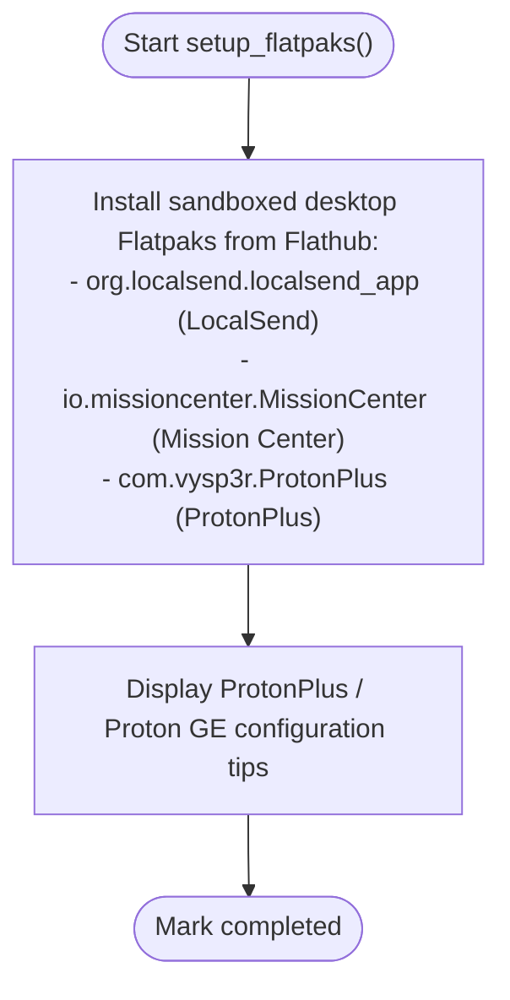

---

### Step 14: Docker Container Engine (`setup_docker`)

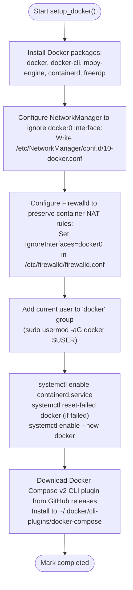

---

### Step 15: KVM/QEMU Hardware Virtualization (`setup_kvm`)

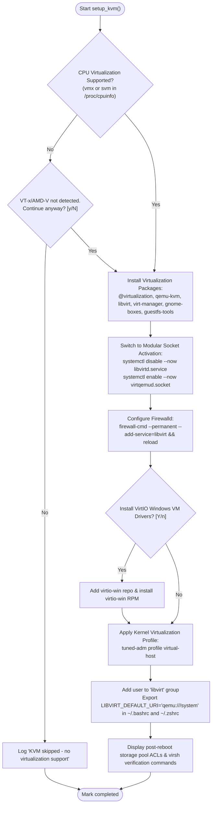

---

### Step 16: Pre-Driver Kernel Gate (`setup_pre_driver_reboot`)

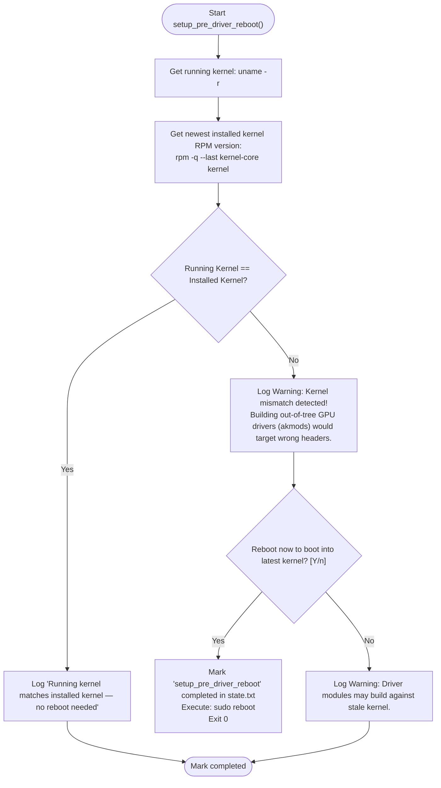

---

### Step 17: GPU Driver Detection & Secure Boot MOK (`setup_drivers`)

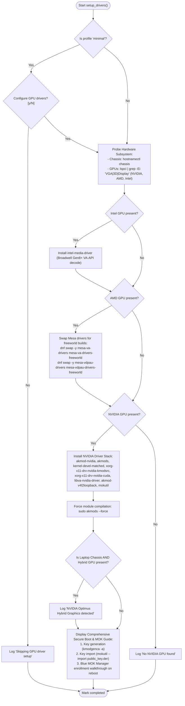

---

### Step 18: Summary & Service Health Check (`show_summary`)

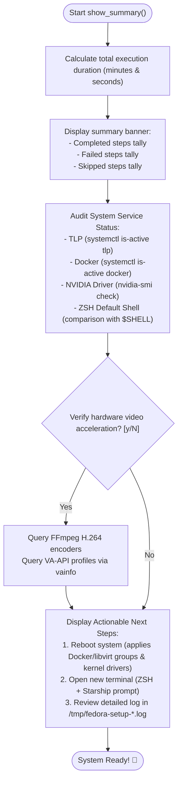

---

## 4. Idempotency, State & Rollback Flowchart

How `setup.sh` handles step resumption, failure recovery, and backup restoration:

```mermaid
flowchart TD
    subgraph StateResumption ["Resumption & Interruption Lifecycle"]
        Launch["User runs ./setup.sh"] --> ReadStateFile["Read ~/.config/fedora-setup/state.txt"]
        ReadStateFile --> StepEvaluator{"For each step in active profile"}
        
        StepEvaluator --> StepInState{"Step function name<br/>present in state.txt?"}
        StepInState -- Yes (No --force) --> SkipToNext["Skip step execution<br/>(Zero redundant downloads or writes)"] --> StepEvaluator
        StepInState -- No (Or --force passed) --> PromptAndRun["Prompt user & Execute step function"]
        
        PromptAndRun --> StepSuccess{"Execution succeeded?"}
        StepSuccess -- Yes --> AppendState["Append function name to state.txt"] --> StepEvaluator
        StepSuccess -- No --> PreserveState["Do NOT write to state.txt<br/>(Step will re-prompt on next run)"] --> StepEvaluator
    end

    subgraph RollbackEngine ["Disaster Recovery & Rollback Subsystem"]
        RunRestore["User launches ./setup.sh -> Confirms 'Restore from previous backup?'"] --> ScanBackups["Find newest directory in ~/.config/fedora-setup-backups/YYYYMMDD_HHMMSS/"]
        ScanBackups --> FoundBackups{"Backup directory found?"}
        FoundBackups -- No --> LogNoBackup["Log 'No backups found' -> Exit 1"]
        FoundBackups -- Yes --> ConfirmRestore{"Restore all files from this timestamp? [y/N]"}
        
        ConfirmRestore -- Yes --> RestoreFiles["Restore original files:<br/>- ~/.zshrc<br/>- ~/.bashrc<br/>- /etc/dnf/dnf.conf<br/>- ~/.config/MangoHud/MangoHud.conf<br/>- ~/.config/starship.toml<br/>- ~/.config/kitty/kitty.conf"]
        RestoreFiles --> WipeState["Delete ~/.config/fedora-setup/state.txt<br/>(Resets state so future runs re-evaluate cleanly)"]
        WipeState --> ExitRestore(["Exit 0 (System restored to original clean state)"])
        ConfirmRestore -- No --> CancelRestore(["Cancel restore"])
    end
```
